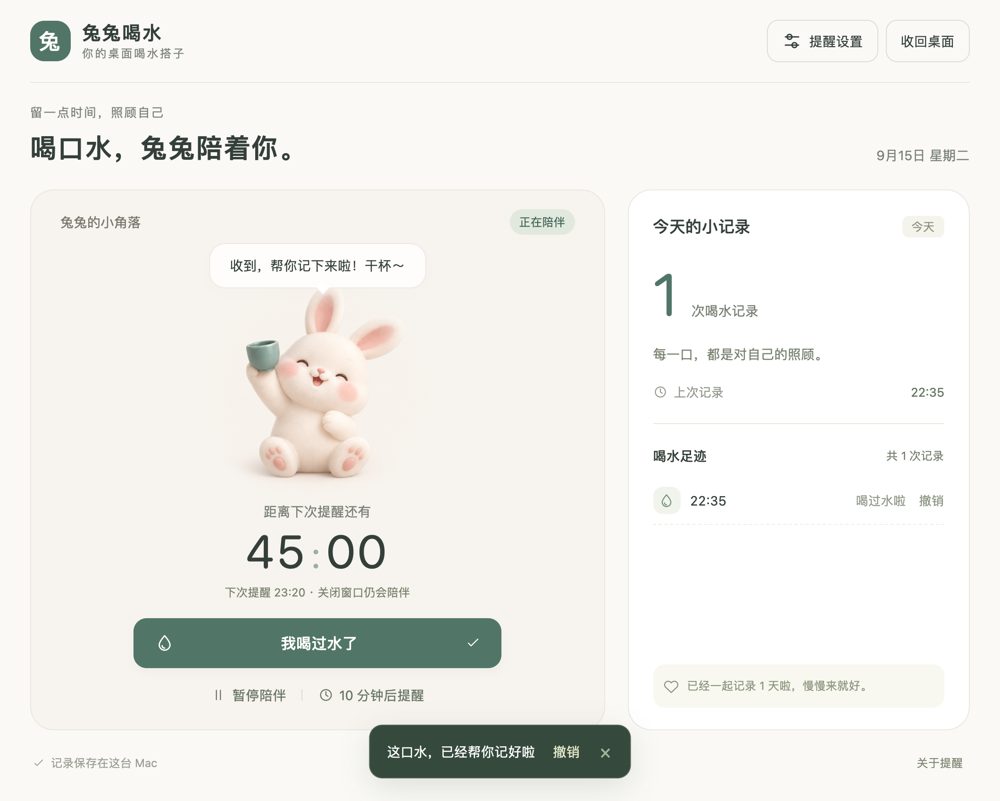

# 兔兔喝水 🐰

一只住在桌面的小兔，陪你记得喝水。到点后举杯、轻跳和摇摆；点击兔兔打开客户端，喝完再记录。



## 下载与安装

在 [Releases（发行版）](https://github.com/Userslzy/tutu-water-companion/releases/latest) 页面下载 [Mac 通用安装包](https://github.com/Userslzy/tutu-water-companion/releases/download/v1.1.0/TutuWater-v1.1.0-macOS-universal.zip)，解压后将「兔兔喝水.app」拖入「应用程序」，双击启动。第一次点击兔兔，选择「开始陪伴」。

- **系统**：macOS 13 及以上；通用包包含 Apple 芯片和 Intel 版本。
- **运行**：桌面版无需浏览器、网络或额外运行环境。
- **首次打开**：应用采用本地签名，尚未进行 Apple Developer ID 签名和公证。如果系统提示无法验证开发者，确认下载来源可信后，可按 [Apple 官方说明](https://support.apple.com/zh-cn/102445)，在「系统设置 → 隐私与安全性」中选择「仍要打开」。
- **更新**：先右键旧兔兔选择「退出兔兔喝水」，再替换应用。喝水记录和设置会保留。

完整步骤见 [使用说明](desktop/使用说明.md)。当前没有 Windows 或手机桌面客户端。

## 桌面陪伴


- **桌面悬浮**：单击展开页面，关闭页面或点击「收回桌面」恢复悬浮；按住拖动可调整位置。
- **到点提醒**：兔兔举杯、轻跳和摇摆，持续显示「该喝水啦！」；无需开启系统通知。开启「减少动态效果」时保留静态提示。
- **完成记录**：点击「我喝过水了」后结束本轮提醒，支持撤销。只打开或关闭页面不会自动完成记录。
- **灵活计时**：默认 45 分钟，可设置 1–240 分钟，支持暂停、继续和 10 分钟后提醒。
- **本地记录**：按本地日期统计当天次数和陪伴天数；无需注册账户。

截图使用自动化测试生成的示例记录。

## 提醒与数据

关闭客户端窗口后，桌面兔兔继续计时。完全退出应用或电脑休眠时无法提醒；再次打开或唤醒后会检查是否到期。不会自动设置开机启动。

桌面版数据保存在 `~/Library/Application Support/TutuWater/water-state.json`。不上传记录，不跨设备同步。应用包与仓库中不包含使用者的数据。

仓库还包含网页版，记录保存在当前浏览器，与桌面版独立。网页版需要保持页面打开，后台标签页可能延迟，无法在关闭浏览器后保持桌面悬浮。

## 从源码运行

### macOS 桌面版

准备 Python 3 和 Apple Command Line Tools（包含 Swift 编译器），在仓库根目录执行：

```sh
python3 desktop/build.py
```

生成 `desktop/output/兔兔喝水.app`，双击运行。生成包含两个架构、使用说明和 SHA-256 校验文件的发布包：

```sh
python3 desktop/package.py
```

输出位于 `desktop/output/releases/`。构建仅使用 Python 标准库与 Apple 系统工具。更多实现与验证说明见 [桌面版开发说明](desktop/README.md)。

### 网页版

```sh
python3 -m http.server 4173 --bind 127.0.0.1 --directory dist
```

在浏览器打开 `http://127.0.0.1:4173`。静态文件位于 `dist/`，无需安装依赖。网页版字体通过 Google Fonts 加载，不可用时使用系统字体；桌面版使用本地系统字体。

### 检查

```sh
node --test tests/model.test.mjs
xcrun swiftc desktop/Sources/State.swift desktop/Sources/ReminderMotion.swift desktop/tests/main.swift -o /tmp/tutu-model-tests
/tmp/tutu-model-tests
./desktop/output/兔兔喝水.app/Contents/MacOS/TutuWater --self-test
```

客户端自检使用独立临时目录，不修改正常使用时的喝水记录。已验证记录、撤销、暂停、延后、跨午夜、到点动画，以及点击展开后关闭仍继续提醒的完整流程。Intel 架构可编译并随包提供；目前实际运行验证环境为 Apple 芯片 Mac。

## 项目结构

- `desktop/Sources/`：桌面悬浮窗、提醒、记录存储与本地页面通信。
- `desktop/desktop.js`：桌面版页面交互。
- `desktop/Assets/`：透明兔兔素材与生成说明。
- `dist/`：静态网页版及桌面版共享的页面素材。
- `tests/`、`desktop/tests/`：计时与记录检查。

角色素材由 AI 为本项目生成，来源与提示词见 [素材说明](desktop/Assets/artwork.md)。
